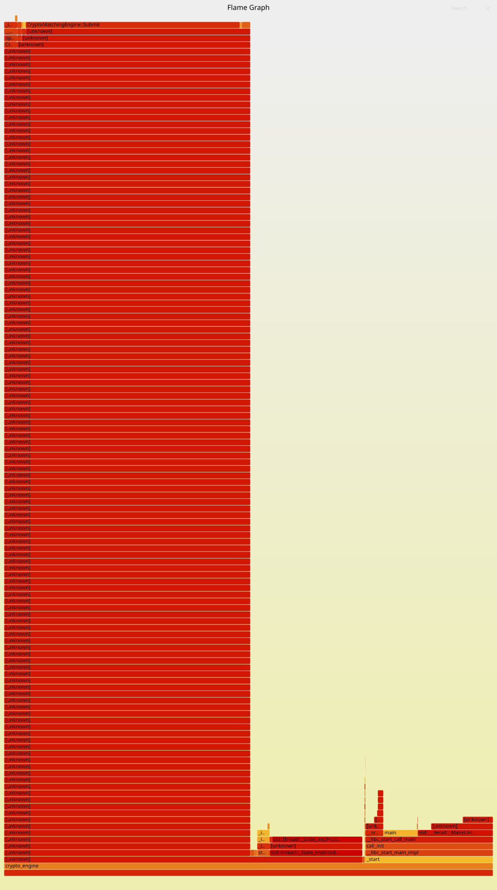

# C++ Low-Latency Matching Engine

**Performance-focused C++ matching engine built around intrusive data structures, pooled memory, lock-free SPSC messaging, and memory-mapped market-data replay.**

The engine is benchmarked on recorded **Binance BTCUSDT** market data and reaches approximately **22M orders/s** in the current test setup. Profiling with **Linux `perf`** shows an **L1D miss rate of ~2.83%**, **branch miss rate of ~2.7%**, and **IPC of ~1.34**.

## Core Design

### Intrusive Order Storage

Orders are linked through an `intrusive_list`, so link metadata lives directly inside each order object instead of requiring separately allocated list nodes. This reduces pointer indirection and avoids extra node allocations in the matching path.

### Memory Pool

A custom **memory pool** provides reusable object storage for frequently created and destroyed orders. The goal is to reduce dependence on general-purpose heap allocation and keep allocation behavior predictable during processing.

### Lock-Free SPSC Queue

A **rigtorp/SPSCQueue** connects a single producer to the matching-engine consumer thread. The SPSC model avoids mutex-based queue coordination and keeps inter-thread handoff lightweight.

### Memory-Mapped Market Data

Historical Binance data is replayed through **mio** using memory-mapped I/O. This keeps the replay path simple and allows the engine to process recorded market data directly from mapped memory.

## Performance

The current benchmark measures end-to-end replay through the producer, **SPSC queue**, and matching engine. File mapping setup and final console output are outside the timed region.

| Metric | Result |
|---|---:|
| Throughput | ~22M orders/s |
| Average processing time | ~45 ns/order |
| CPU cycles | 825M |
| Instructions | 1.10B |
| IPC | 1.34 |
| Branch miss rate | 2.7% |
| L1D miss rate | 2.83% |

## Profiling

The engine is profiled with an optimized build using **Linux `perf`** and **FlameGraph** to inspect CPU hotspots, cache behavior, branch prediction, and STL/data-structure overhead.

```bash
-O3 -g -fno-omit-frame-pointer
perf record -F 999 -g --call-graph fp ./crypto_engine
perf stat ./crypto_engine
```



## Real Market Data

The workload uses recorded **Binance BTCUSDT** orders rather than synthetic microbenchmarks. This gives the engine a realistic stream for testing matching throughput, queue behavior, memory access patterns, and cache locality.

## Technology

**C++17** · **Linux** · **CMake** · **Low-Latency Systems** · **Matching Engine** · **Intrusive Data Structures** · **Memory Pool** · **Lock-Free SPSC** · **Memory-Mapped I/O** · **Linux perf** · **FlameGraph** · **Cache Locality** · **Branch Prediction** · [**rigtorp/SPSCQueue**](https://github.com/rigtorp/SPSCQueue) · [**mio**](https://github.com/mandreyel/mio)
